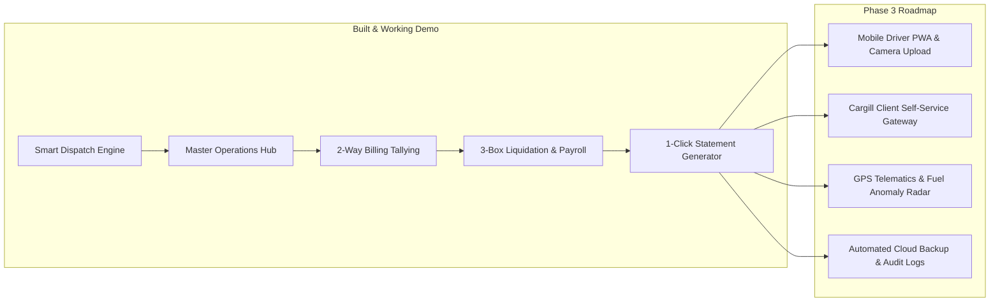

# 🚚 MASTER COMMERCIAL & TECHNICAL PROPOSAL
## PORBIDO TRUCKING & HAULING SERVICE
### Custom Transportation Management System (TMS) & Billing Reconciliation Engine

**Target Client**: Porbido Trucking & Hauling Service Management (Urdaneta City, Pangasinan)  
**Client Partner**: Cargill Philippines, Inc. (Pulilan Plant & Regional Hubs)  
**Document Version**: 2.0 (Senior Engineering Commercial & Technical Proposal)  
**Date**: August 2026  

---

## 1. Executive Summary & Project Vision

**Porbido Trucking & Hauling Service** is a contracted logistics provider operating out of Urdaneta City, Pangasinan, hauling raw agricultural commodities (corn, feed ingredients, bulk grains) for **Cargill Philippines, Inc.** across major manufacturing plants, ports, and regional facilities.

### The Operational Challenge
Managing a fleet of 8 heavy-duty trucks (including 4 active 10-wheelers: `CCK 5273`, `NAK 2202`, `CAK 2693`, `CAO 3510`, `RHA 965`) with only **two administrative staff** using manual Excel spreadsheets, paper receipts, and cluttered Messenger group chats has created a high-risk operational bottleneck.

### The Solution: Custom TMS
We propose deploying a web-based, error-proof **Transportation Management System (TMS)** engineered specifically for Porbido's workflows. The system eliminates weight entry typos, automates Cargill rate math, enforces TLO numerical integrity, tracks driver Cash-on-Hand (COH), bi-directionally reconciles Cargill billing summaries, and exports 1-click official PDF billing statements.

> 🌟 **Key Advantage**: Unlike typical software proposals, **our Phase 1 MVP and Phase 2 Financial Modules are ALREADY 90%+ DEVELOPED and running in a live working demonstration system**, drastically reducing project risk and ensuring rapid deployment.

---

## 2. Operational Audit & Evidence of Financial Leaks

A direct comparative audit between Porbido’s historical Internal Driver Billing Ledgers (`docs/CCKBILLING2026.pdf`) and Cargill’s Official Billing Summaries (`docs/29-50 (1).pdf`) proves that manual spreadsheets are actively costing Porbido money.

| Identified Vulnerability | Manual Process Risk | Direct Financial & Operational Impact |
|---|---|---|
| **1. Weight Transcription Typos** | Staff manually copy weight tonnage from physical paper tickets into Excel cells. | **DIRECT FINANCIAL LOSS**: Sample audit revealed `-0.07T` and `-0.11T` typos resulting in `₱151.90` lost across just 3 trips. Across 8 trucks, these accumulate to tens of thousands of pesos annually. |
| **2. Destination Mislabeling** | Route locations are typed as unvalidated plain text. | **PAYMENT DELAYS**: Invoice rejection during Cargill's monthly audit cycle due to route mismatches (e.g., `Iloilo ➔ Pulilan` logged instead of `Iloilo ➔ Manila`). |
| **3. Unbilled / Lost Trips** | Delivery Receipts (PODs) and dispatch assignments get buried in noisy Messenger group chats. | **UNCOLLECTED REVENUE**: Completed trips are forgotten or missed during monthly 30-day invoicing. |
| **4. Broken Excel Formulas** | Manual formula editing in Excel leads to cell corruption (`#REF!` errors). | **ZERO PROFIT VISIBILITY**: Management loses visibility into true net trip income when total expense formulas break. |
| **5. Cash-on-Hand (COH) Black Hole** | Driver cash advances, fuel receipts, and salary deductions are recorded on loose paper notes. | **PAYROLL DISCREPANCIES**: Inaccurate carry-over balances and unliquidated driver deficits. |

---

## 3. Core System Scope & Working System Modules (Built & Verified)

The system is structured into high-performance, modular components designed for low eye-fatigue and maximum administrative efficiency.

### Module 1: Executive Operations Dashboard (`/dashboard`)
- Real-time KPI counters: Active Fleet Count, Dispatched Today, Unbilled Freight (₱), and Typo Discrepancies Alert.
- Fleet asset status cards and live recent dispatch activity feed.

### Module 2: Error-Proof Dispatch Entry & TLO Engine (`/dispatch`)
- **Strict TLO# Validation**: Enforces non-empty, unique numerical format (e.g., `#904816`) with real-time Firestore duplicate detection.
- **Automated Route Auto-Fill**: Dropdown selection of master Cargill routes automatically sets base rates and calculates freight:
  $$\text{Freight Charge} = (\text{Tonnage} \times \text{Base Rate}) + \text{Re-route Fee } (\text{₱}3,600) + \text{Extra Fees}$$
- **Fleet Guardrails**: Restricts plate selection strictly to registered assets (`CCK 5273`, `NAK 2202`, `CAK 2693`, `CAO 3510`, `RHA 965`).

### Module 3: Master Operations Hub & 13-Column Porbido Table (`/trips`)
- Non-scrollable 100% viewport width fluid table layout displaying all 13 exact Porbido report parameters:
  `Trip & TLO #`, `Date & Route`, `Freight & Rate`, `Cash on Hand`, `Trip Expenses (Diesel, Meals, Tolls)`, `Driver & Helper Pay`, `Status`.

### Module 4: Standalone Trip Details & Liquidation Page (`/trips/:id`)
- Visual route map indicator and rate breakdown.
- **Driver Cash-on-Hand (COH) Ledger**: Rolling transaction log with "+ Add Cash Amount" modal and concise categories (`DISPATCH_ADVANCE`, `ADDITIONAL_SENT`, `ATM_WITHDRAWAL`, `EMERGENCY_REPAIR`).
- **Driver Previous Trip Deficit/Credit Banner**: Automatic carry-over of unliquidated shortages or overages.
- **POD Verification Panel**: Blurry photo flagging and approve-to-bill controls.

### Module 5: Bi-Directional 2-Way Tallying & Reconciliation Kanban (`/billings`)
- Cross-matches Porbido Driver Billing against Cargill Client Summaries using `TLO #` as key.
- 4 Reconciliation Column Board:
  1. ✅ `RECONCILED`: Matching records on both sides.
  2. ⚠️ `AMOUNT_DISCREPANCY`: Tonnage or freight charge mismatch.
  3. 🔴 `UNBILLED_CARGILL`: Recorded in Porbido logs, missing from Cargill statement (Unclaimed Revenue).
  4. 🟠 `UNRECORDED_PORBIDO`: Present in Cargill statement, missing from Porbido logs.

### Module 6: Driver & Helper Payroll & Cash Advance Module (`/payroll`)
- **Destination-Based Pay Rate**: Higher premium trip rates for cross-sea long-haul runs (`Pulilan ➔ Iloilo`, `Iloilo ➔ Manila`) vs inland runs.
- **Cash Advance (CA) & Shortage Deductions**:
  $$\text{Net Salary Payable} = \text{Gross Trip Earnings} - \text{Cash Advance Deductions} - \text{Shortage Deductions}$$
- Interactive Payslip Settlement Modal and "+ Record Cash Advance" modal.

### Module 7: Enterprise Report Generator & Statement Hub (`/reports`)
- **Template 1: Official Cargill Client Billing Summary Statement**: Pixel-perfect invoice layout matching `docs/29-50 (1).pdf` (Billing Summary No. `34_B`, 30-day terms, TIN, itemized TLO lines, ₱3,600 re-route charges, and signature blocks).
- **Template 2: Porbido 3-Box Driver Settlement & Liquidation Sheet**: Internal liquidation sheet matching `docs/CCKBILLING2026.pdf` (Box 1: COH, Box 2: Payroll, Box 3: Net Profit).
- **Template 3: Executive Fleet Profitability Audit Statement**.
- One-click **"Print / Save PDF"** (`@media print`) and **"Export CSV"** features.

---

## 4. Future System Expansion & Phase 3 Technical Roadmap

To ensure long-term scalability, the system architecture supports future module expansions:



### Proposed Phase 3 Future Modules:
1. **Mobile Driver PWA & Offline Photo Upload Queue**:
   A lightweight smartphone interface for drivers to snap signed Delivery Receipts (PODs) and weighbridge tickets even in low-signal areas, auto-syncing when reconnected.
2. **Cargill Client Self-Service Gateway**:
   A dedicated read-only client portal allowing Cargill logistics directors to review billing summaries and download verified POD receipts directly.
3. **GPS Telematics & Fuel Expense Anomaly Radar**:
   Integration with truck GPS tracking to cross-check reported diesel expenses against actual mileage and detect fuel theft or route deviations.
4. **Automated Cloud Backup & Role Audit Trail**:
   Daily automated Firestore database snapshots and role-based access logs tracking administrative changes.

---

## 5. Commercial Investment & Payment Schedule

### Financial Investment

| Project Phase | Deliverables & Scope Included | Investment |
|---|---|---|
| **Phase 1: Core Operations & Error-Proof Billing System (MVP)** | Smart Dispatch Form, Dropdown Route Selectors, Strict TLO Rules, Auto-Math Freight Engine, POD Verification Panel, Master Operations Hub. | **₱45,000.00** |
| **Phase 2: Financial Reconciliation & Rolling Ledger Expansion** | Rolling Driver COH Settlement Ledger, Automatic COH Carry-Over Engine, Cargill 2-Way Reconciliation Matrix, Driver Payroll Module, 1-Click Cargill PDF Statement Generator. | **₱30,000.00** |
| **★ COMPLETE BUNDLE SPECIAL (Phases 1 & 2 Combined)** | **Full end-to-end deployment including both operational dispatching, financial reconciliation, driver payroll, and 1-click PDF statement exports.** | **₱68,000.00**<br>*(Save ₱7,000.00)* |

---

### Payment Structure & Milestones (40 / 40 / 20 Split)

Payments are structured into three performance milestones tied directly to verifiable software deliverables:

| Milestone | Trigger / Deliverable Checkpoint | Split % | Amount (Phase 1 / Bundle) |
|---|---|---|---|
| **1. Kickoff Deposit** | Proposal signing, project initialization, and database setup. | **40%** | **₱18,000.00 / ₱27,200.00** |
| **2. Beta Review** | Functional core system built and demonstrated with sample Cargill data. | **40%** | **₱18,000.00 / ₱27,200.00** |
| **3. Final Handover** | Production deployment, staff 1-on-1 training, and source code handover. | **20%** | **₱9,000.00 / ₱13,600.00** |

---

### 4-Week Development & Deployment Timeline

```
Week 1: Database Architecture & Smart Dispatch Hub
├── Fleet Asset & Driver Directory Setup
└── Smart Dispatch Form with Route Dropdowns & TLO Validation

Week 2: Auto-Math Freight Engine & Operational Hub
├── Automated Freight Charge Math (Tonnage × Base Rate + ₱3,600 Re-route)
└── Master Operations Hub & 13-Column Porbido Table

Week 3: Financial Reconciliation & Driver Payroll
├── 2-Way Tallying Matrix (Porbido vs Cargill Cross-Matching)
└── Driver & Helper Payroll Module with COH Carry-Over

Week 4: Acceptance Testing, Staff Training & Go-Live!
├── User Acceptance Testing (UAT) with Historical Data
├── Staff 1-on-1 Training Session
└── Official Production Deployment & Go-Live
```

---

## 6. Warranty, SLA & Support Terms

- **30-Day Complimentary Post-Launch Warranty (Free)**:
  Includes 30 calendar days of technical support following production go-live covering bug fixes, formula tweaks, database adjustments, and administrative assistance.
- **Optional Ongoing Technical SLA Package (₱3,500.00 / month)**:
  Following the 30-day warranty, Porbido may opt for an ongoing technical SLA agreement covering:
  - Cloud hosting management & security patches
  - Automated daily database backups & data safety guarantees
  - Priority technical support & minor feature enhancements

---

## 7. Technical Specifications

- **Frontend Framework**: Angular v21+ with Standalone Components & Angular Signals (`signal()`, `computed()`).
- **Typography & Styling**: Tailwind CSS v3 with `Plus Jakarta Sans` Google Font and Tabular Numeral Alignment (`font-variant-numeric: tabular-nums`).
- **Backend & Database**: Direct Firebase integration (`firebase` v10 SDK with Firestore realtime listeners, Auth, & Cloud Storage).
- **Print & PDF Engine**: Native browser `@media print` CSS engine for pixel-perfect document rendering.

---

### Acceptance & Sign-off

**Prepared by**: Senior Software Engineering Team  
**Approved & Accepted by**:  

______________________________________  
**Porbido Trucking & Hauling Service Management**  
Date: ________________________  
